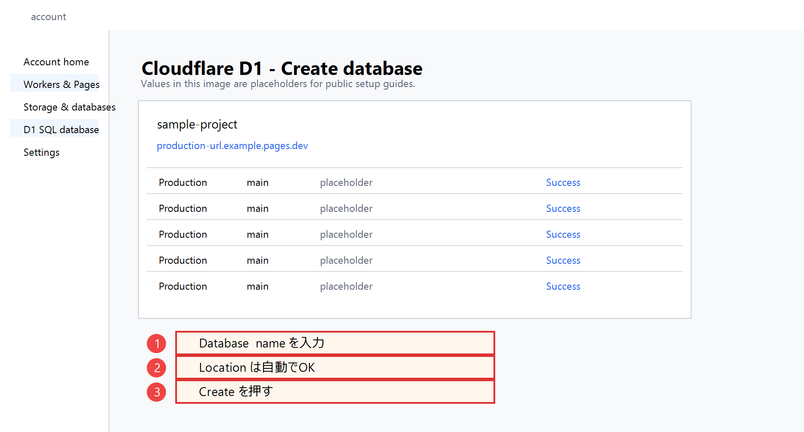
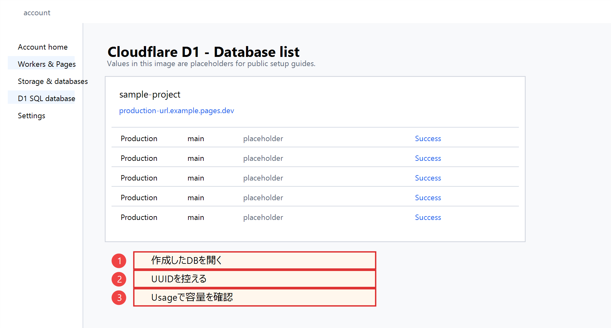
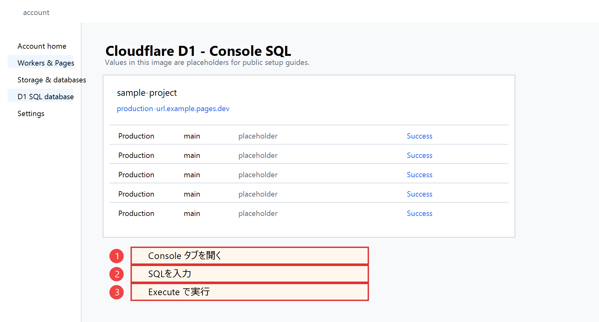
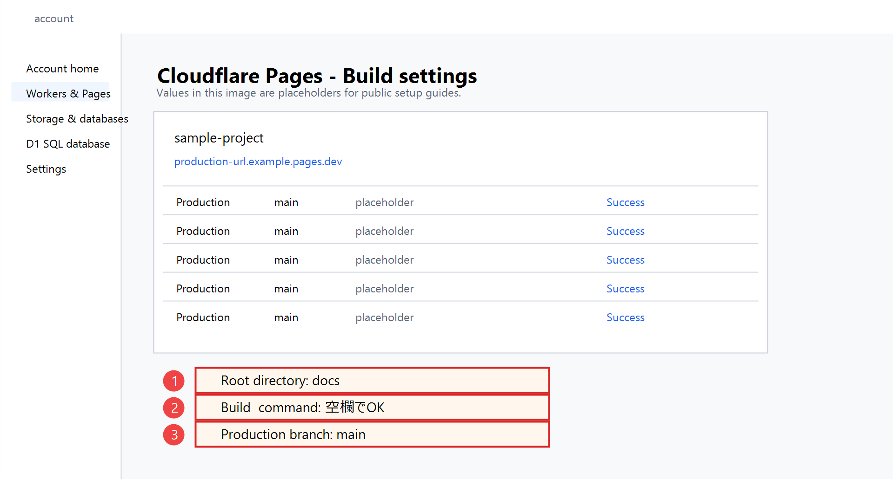
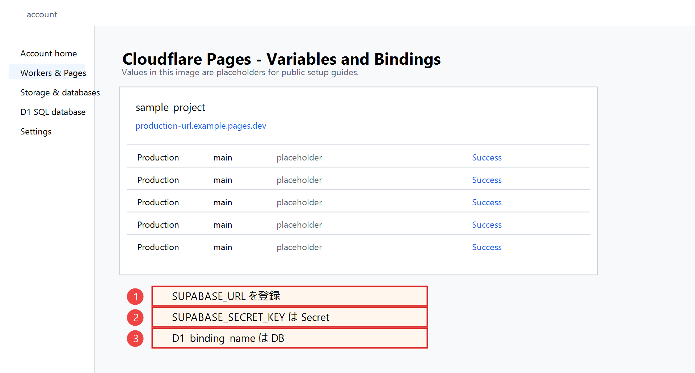
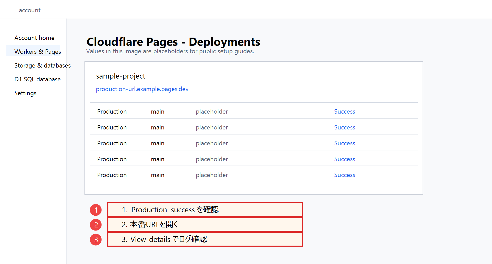
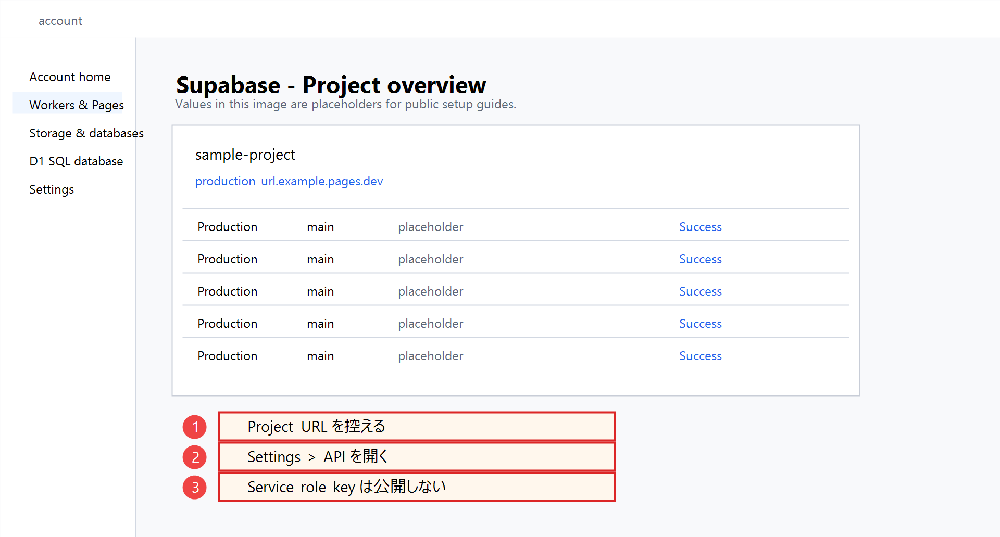
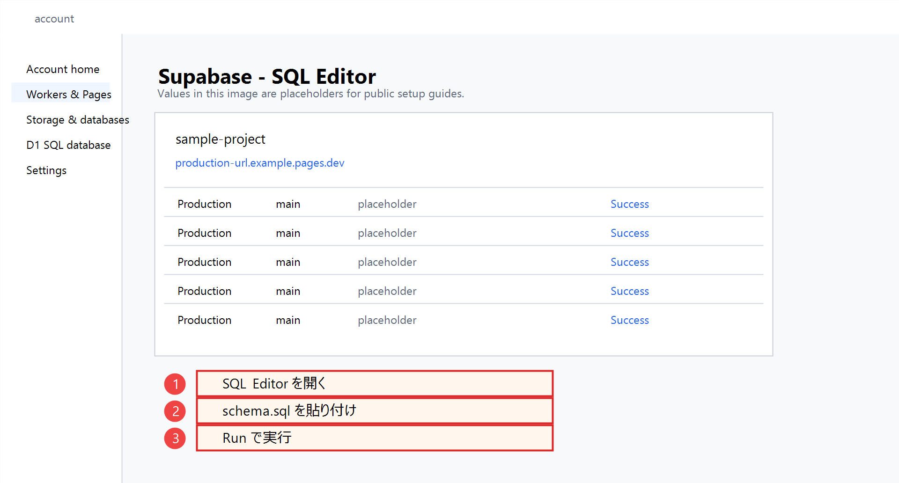

# Cloudflare / D1 / Supabase 詳細設定

このプロジェクトは、D1を編集元データベースにし、公開サイトは静的JSONを読む構成を標準にしています。Supabaseは旧運用やSpreadsheet移行のために残しています。

## 推奨構成

```text
Cloudflare Pages
  docs/ を公開
  標準では docs/data/*.json を読む
  動的API運用では functions/api/data.js を /api/data として実行
  動的API運用ではD1 binding `DB` を読む

Cloudflare D1
  歌枠、曲、アーティスト、チャンネル、キー、ジャンルを保存

admin-server/
  ローカル/Tailscale内だけで起動
  Cloudflare D1 REST APIへ書き込み

Supabase
  旧Spreadsheetインポート運用を続ける場合だけ使用
```

## データ公開方式

公開サイトのデータ取得には2通りあります。

| 方式 | 標準 | 必要なもの | 向いているケース |
| --- | --- | --- | --- |
| 静的JSON運用 | はい | `docs/data/*.json` | 低コストで壊れにくく、GitHub pushで更新したい |
| 動的API運用 | 任意 | Pages Functions + D1 binding `DB` | D1更新を `/api/data` へ直接反映したい |

[docs/js/data.js](docs/js/data.js) は、まず `docs/data/*.json` を読みます。静的JSONが読めない場合だけ `/api/data` へフォールバックします。

そのため、最初に公開する人は次の流れが一番簡単です。

```text
admin-serverでD1を編集
管理画面で静的JSONを生成
docs/data/*.json をcommitしてpush
Cloudflare Pagesが再デプロイ
```

`/api/data` をD1直読みで使いたい場合だけ、Cloudflare PagesにD1 bindingを設定してください。

## GitHub

Cloudflare Pagesで公開する場合、GitHub repositoryを接続しておくと、`main` ブランチへpushするだけで自動デプロイできます。

### 1. 公開用repositoryを作る

GitHubで新しいrepositoryを作ります。

おすすめ:

```text
Repository visibility: Public または Private
Add README: 既存READMEがあるのでOFF
Add .gitignore: 既存.gitignoreがあるのでOFF
Add license: 必要なら後で追加
```

公開テンプレートとして配るならPublic、まず自分用に試すならPrivateで始めるのが安全です。Private repositoryでもCloudflare Pagesへ接続できます。

### 2. push前に秘密情報を確認する

このプロジェクトでは、次のファイルをGitに入れない前提です。

```text
admin-server/.env
*.har
*.log
*.tmp
*.db
*.sqlite
tools/__pycache__/
```

[.gitignore](.gitignore) に設定済みですが、push前に必ず確認します。

```powershell
git status
```

入っていたら止めるもの:

```text
Cloudflare API token
Supabase secret key / service_role key
ADMIN_TOKEN
実アカウントのメールアドレスが写ったスクリーンショット
HARファイル
ローカルDBやログ
```

文字列検索する場合:

```powershell
rg -n "CLOUDFLARE_API_TOKEN|SUPABASE_SECRET_KEY|ADMIN_TOKEN|Bearer|service_role|\\.har|\\.log" .
```

`replace_with_...` や `xxxxx` のようなプレースホルダーは公開して大丈夫です。本物の値が出た場合は、Gitに入れる前に消します。

### 3. 最初のcommitとpush

ローカルでcommitします。

```powershell
git add .
git commit -m "Prepare public songlist template"
```

GitHubのrepository URLをremoteに設定します。

```powershell
git remote add origin https://github.com/your-account/your-repository.git
git branch -M main
git push -u origin main
```

すでにremoteがある場合:

```powershell
git remote -v
git push
```

### 4. Cloudflare PagesとGitHubを接続する

Cloudflare Dashboardで:

1. `Workers & Pages` を開く
2. `Create application` を押す
3. `Pages` を選ぶ
4. `Connect to Git` を選ぶ
5. GitHub accountを連携する
6. 対象repositoryを選ぶ
7. Build settingsを設定する

このプロジェクトのBuild settings:

```text
Production branch: main
Framework preset: None
Build command: 空欄
Build output directory: docs
Root directory: 空欄またはリポジトリルート
```

`wrangler.example.toml` も同梱しています。CLIやローカル検証で使いたい場合だけ `wrangler.toml` にコピーし、`database_id` を自分のD1 Database IDへ置き換えてください。Cloudflare Dashboard上でPagesとD1 bindingを設定するだけなら、コピーしなくても公開できます。

### 5. GitHubに入れるもの / 入れないもの

入れるもの:

```text
docs/
functions/
d1/schema.sql
admin-server/env.example
README.md
VTUBER_SETUP.md
INFRA_SETUP.md
AI_HELP_PROMPTS.md
```

入れないもの:

```text
admin-server/.env
実トークンを含むメモ
HAR
ログ
ローカルDB
個人情報が写った画像
```

GitHub repositoryをPublicにした後で秘密情報をpushしていたことに気づいた場合は、ファイルを消すだけでは不十分です。CloudflareやSupabase側で該当token/keyを削除し、新しいものを作り直してください。

## Cloudflare D1

### 1. D1 databaseを作る

Cloudflare Dashboardで作る場合:

1. Cloudflare Dashboardを開く
2. `Workers & Pages` へ移動
3. `D1 SQL Database` または `D1` を開く
4. `Create database` を押す
5. Database nameを入力する



名前例:

```text
vtuber-songlist-prod
```

CLIで作る場合:

```powershell
npx wrangler d1 create vtuber-songlist-prod
```

あとで使う値:

```text
Database ID
Database name
Account ID
```

`Database ID` は `admin-server/.env` の `CLOUDFLARE_D1_DATABASE_ID` に入れます。

D1一覧では、作成済みdatabaseの名前とUUIDを確認できます。



### 2. テーブルを作る

D1 ConsoleのSQL editorで [d1/schema.sql](d1/schema.sql) を実行します。

1. 対象D1 databaseを開く
2. `Console` タブを開く
3. [d1/schema.sql](d1/schema.sql) の中身をSQL入力欄へ貼り付ける
4. `Execute` を押す



このSQLで作る主なテーブル:

```text
channels
artists
songs
streams
stream_songs
song_channel_stats
live_events
live_event_songs
```

この一色イズ版では、初期状態で `channels` に次の1行が入ります。

```text
new / 歌った曲リスト
```

リアルライブ情報は `live_events` と `live_event_songs` に保存され、公開サイトでは「ライブ情報」タブに閲覧専用で表示されます。

### 3. 曲リストの初期データSQLを作る

最新のリストCSVからD1初期投入用SQLを生成します。リストCSVのB列を曲名、D列をアーティスト名として読み、E列の歌唱回数を `song_channel_stats` に入れます。
ジャンルはこの初期SQLでは空のままにします。後から管理画面のCSV同期で `genre` を追加します。

```powershell
npm run d1:seed-sql
```

生成先:

```text
d1/generated/songlist_seed.sql
```

D1 Consoleで [d1/schema.sql](d1/schema.sql) を実行した後、続けて `d1/generated/songlist_seed.sql` を実行します。

ジャンルを後からCSVで追加する場合は、管理画面のCSV同期に次の列名を含むCSVを読み込ませます。

```csv
title,artist,genre,display_key
```

テンプレートは [d1/genre_import_template.csv](d1/genre_import_template.csv) に置いてあります。`display_key` が不要なら空欄で大丈夫です。

チャンネル行は [d1/schema.sql](d1/schema.sql) の末尾で次のように設定済みです。内部IDは `new` のまま使います。

```sql
INSERT INTO channels (code, name, sort_order)
VALUES
  ('new', '歌った曲リスト', 1)
ON CONFLICT(code) DO UPDATE SET
  name = excluded.name,
  sort_order = excluded.sort_order;
```

そのため [docs/js/config.js](docs/js/config.js) の `CHANNELS` も `new` だけ、`SHOW_COMBINED_CHANNEL = false` にしています。

```js
export const CHANNELS = {
  new: {
    id: 'new',
    label: 'メインch',
    listGid: '0',
    setlistGid: 'replace_with_main_setlist_gid',
  },
};

export const DEFAULT_CHANNEL = 'new';
export const SHOW_COMBINED_CHANNEL = false;
```

すでに2チャンネルでD1を作った後に1チャンネルへ変える場合:

```sql
DELETE FROM channels WHERE code = 'old';
UPDATE channels SET name = '歌った曲リスト', sort_order = 1 WHERE code = 'new';
```

`old` 側に本番データがある場合は、削除前にバックアップしてください。

### 3. 動作確認SQL

D1 Consoleで実行します。

```sql
SELECT id, code, name, sort_order FROM channels ORDER BY sort_order;
```

期待する結果:

```text
new / 歌った曲リスト
```

または自分で設定したチャンネル行が返ります。

リアルライブ用テーブルも確認する場合:

```sql
SELECT name FROM sqlite_master
WHERE type = 'table' AND name IN ('live_events', 'live_event_songs')
ORDER BY name;
```

## Cloudflare Pages

### 1. Pages projectを作る

Cloudflare Dashboardで作る場合:

1. `Workers & Pages` を開く
2. `Create application` を押す
3. `Pages` を選ぶ
4. GitHub repositoryを接続する
5. Build settingsを設定する

このプロジェクトは静的HTML/JSなので、基本設定は次です。

```text
Framework preset: None
Build command: 空欄
Build output directory: docs
Root directory: 空欄またはリポジトリルート
```

`functions/` はCloudflare Pages Functionsとして自動的に使われます。

PagesのBuild設定では、`Build output directory` が `docs` になっていることを確認します。



### 2. D1 bindingを追加する

Cloudflare公式ドキュメントでは、Pages FunctionsへD1を渡すにはPages projectのBindingsからD1 database bindingを追加します。

静的JSON運用だけなら、この設定がなくてもトップページは表示できます。`/api/data` と `/api/d1-test` を使う場合は必ず設定します。

Dashboardの場合:

1. `Workers & Pages` を開く
2. 対象のPages projectを選ぶ
3. `Settings` を開く
4. `Bindings` を開く
5. `Add` から `D1 database bindings` を選ぶ
6. Variable nameに次を入れる

```text
DB
```

7. D1 databaseで作成済みのdatabaseを選ぶ
8. 保存する
9. Pagesを再デプロイする



重要: このコードは `env.DB` を読んでいます。binding名を `DB` 以外にすると、次のファイルも修正が必要です。

```text
functions/api/data.js
functions/api/d1-test.js
```

### 3. Pages環境変数

必要に応じて、Pages projectの `Settings > Environment variables` に設定します。

```text
ORIGINAL_GENRE_KEYWORDS
```

例:

```text
ORIGINAL_GENRE_KEYWORDS=Vtuber名,ユニット名,オリジナル企画名
```

この値は `/api/data` がD1の `songs.genre` が空の曲にジャンルを推定するときだけ使います。D1の `songs.genre` に値が入っていれば、そちらが優先されます。

### 4. Pages公開後の確認

```text
https://your-site.example/api/d1-test
https://your-site.example/api/data
https://your-site.example/admin.html
```

Deployments画面では、Productionの最新デプロイがSuccessになっていることを確認します。



`/api/d1-test` が `D1 binding DB is missing` を返す場合:

```text
Pages projectのD1 binding名がDBではない
binding追加後に再デプロイしていない
Preview環境だけにbindingしてProduction環境へbindingしていない
```

`/api/data` がSQLエラーを返す場合:

```text
d1/schema.sqlを実行していない
テーブル名やカラム名を変更した
対象D1 databaseを間違えてbindingしている
```

## Cloudflare API Token

ローカル管理サーバーはCloudflare D1 REST APIへ直接書き込みます。そのためCloudflare API tokenが必要です。

### 1. Tokenを作る

Cloudflare Dashboardで:

1. 右上のプロフィールから `My Profile` を開く
2. `API Tokens` を開く
3. `Create Token` を押す
4. Custom tokenを作る
5. 対象Accountを限定する
6. D1を編集できる権限を付ける

権限はCloudflareの画面表記に合わせて、D1 databaseの編集/読み書きができる最小権限にします。広すぎる `Account: Edit` などは避けます。

画面上の項目名の目安:

```text
Permissions:
  Account / D1 / Edit

Account Resources:
  Include / 対象のCloudflare account
```

Cloudflareの画面表記が変わっている場合は、「D1を読み書きできるAccount権限」を選びます。Workers、DNS、Zone全体の編集権限はこの管理サーバーには不要です。

### 2. Tokenを保存する場所

保存先はローカルの [admin-server/.env](admin-server/env.example) だけです。

```env
CLOUDFLARE_API_TOKEN=replace_with_cloudflare_api_token
```

公開禁止:

```text
GitHub
README
docs/*.html
Cloudflare Pagesの公開フロントエンド変数
チャット
スクリーンショット
```

漏れた場合は、Cloudflare Dashboardでtokenを削除して作り直します。

## admin-server/.env

[admin-server/env.example](admin-server/env.example) を `admin-server/.env` にコピーします。

```env
CLOUDFLARE_ACCOUNT_ID=replace_with_cloudflare_account_id
CLOUDFLARE_D1_DATABASE_ID=replace_with_d1_database_id
CLOUDFLARE_API_TOKEN=replace_with_cloudflare_api_token

ADMIN_HOST=127.0.0.1
ADMIN_PORT=8788
ADMIN_TOKEN=replace_with_private_admin_password

ADMIN_TITLE=replace_with_vtuber_name 歌枠管理
ORIGINAL_GENRE_KEYWORDS=replace_with_vtuber_name,replace_with_unit_name
KEY_REFERENCE_CSV_URL=https://docs.google.com/spreadsheets/d/your_spreadsheet_id/edit?gid=your_gid#gid=your_gid
```

各項目:

| 変数 | 必須 | 用途 |
| --- | --- | --- |
| `CLOUDFLARE_ACCOUNT_ID` | 必須 | D1 REST APIのAccount指定 |
| `CLOUDFLARE_D1_DATABASE_ID` | 必須 | 書き込み先D1 database |
| `CLOUDFLARE_API_TOKEN` | 必須 | D1 REST API認証 |
| `ADMIN_HOST` | 任意 | 通常は `127.0.0.1` |
| `ADMIN_PORT` | 任意 | 通常は `8788` |
| `ADMIN_TOKEN` | 推奨 | 管理画面/APIの簡易パスワード |
| `ADMIN_TITLE` | 任意 | 管理画面のタイトル |
| `ORIGINAL_GENRE_KEYWORDS` | 任意 | オリジナル曲判定 |
| `KEY_REFERENCE_CSV_URL` | 任意 | キー/ジャンル一括同期元 |

起動:

```powershell
node admin-server\server.js
```

確認:

```text
http://127.0.0.1:8788/api/health
```

Tailscale:

```powershell
tailscale serve http://127.0.0.1:8788
```

## Supabase

SupabaseはD1編集元/静的JSON公開の標準運用では必須ではありません。次のどちらかの場合だけ使います。

```text
既存のSupabase運用を続けたい
Google SheetsからSupabaseへ取り込む旧ツールを使いたい
```

### 1. Supabase projectを作る

1. Supabase Dashboardを開く
2. New projectを作る
3. Project URLを控える
4. API keyを控える

必要な値:

```text
SUPABASE_URL
SUPABASE_SECRET_KEY
```

Project overviewでは、Project URLとDatabaseの状態を確認できます。



Supabase公式ドキュメントでは、API URLはDashboardの `Integrations > Data API`、API keysはProject Settingsの `API Keys` から確認できます。`sb_secret_...` や legacy `service_role` は高権限キーなので、サーバーやローカル管理処理だけで使います。

### 2. Supabase schemaを作る

Supabase SQL Editorで [supabase/schema.sql](supabase/schema.sql) を実行します。



確認:

```sql
select code, name, sort_order from channels order by sort_order;
```

### 3. Spreadsheet importを実行する

PowerShell例:

```powershell
$env:SONGLIST_SPREADSHEET_ID="your_spreadsheet_id"
$env:SONGLIST_NEW_LIST_GID="0"
$env:SONGLIST_NEW_SETLIST_GID="123456789"
$env:SONGLIST_OLD_LIST_GID="987654321"
$env:SONGLIST_OLD_SETLIST_GID="234567890"

$env:SUPABASE_URL="https://your-project-ref.supabase.co"
$env:SUPABASE_SECRET_KEY="sb_secret_..."
python tools\import_supabase.py
```

削除も反映する場合:

```powershell
python tools\import_supabase.py --reset
```

注意:

```text
SUPABASE_SECRET_KEY / service_role keyは公開しない
ブラウザ側のJavaScriptに入れない
Cloudflare Pagesの公開HTMLへ出さない
URLクエリに入れない
```

## D1/静的JSONとSupabaseの使い分け

| 項目 | D1編集元 + 静的JSON公開 | Supabase旧運用 |
| --- | --- | --- |
| 公開データ | 標準は静的JSON、任意で `/api/data` がD1を読む | 古い実装向け |
| 管理画面 | `admin-server/` がD1へ書く | 対象外 |
| Spreadsheet取り込み | 手動/別途D1 import | `tools/import_supabase.py` |
| 推奨 | 新規導入はこちら | 既存データ移行用 |

新しいVtuberさん用に作るなら、D1で編集して静的JSONを公開する運用から始めるのが一番シンプルです。

## 最小チェックリスト

- GitHubへpushする前に `git status` を確認した
- `admin-server/.env`、HAR、ログ、ローカルDBがGitに入っていない
- D1 databaseを作った
- D1 Consoleで `d1/schema.sql` を実行した
- D1に `live_events` / `live_event_songs` が作成されている
- Pagesのbuild output directoryが `docs`
- 動的API運用を使う場合はPages Functionsが有効
- 動的API運用を使う場合はPagesのD1 binding名が `DB`
- D1 bindingを追加した場合は再デプロイした
- `admin-server/.env` にAccount ID、D1 Database ID、API Tokenを入れた
- `ADMIN_TOKEN` を設定した
- 管理画面で歌枠追加、リアルライブ情報追加、静的JSON生成ができる
- 動的API運用を使う場合は `/api/d1-test` がD1の結果を返す
- 静的JSON運用ではトップページが `docs/data/*.json` の内容を表示する
- 静的JSON運用では `docs/data/lives.json` の内容が「ライブ情報」に表示される
- 動的API運用を使う場合は `/api/data` がJSONを返す
- Supabaseを使う場合だけ `SUPABASE_URL` と `SUPABASE_SECRET_KEY` を設定した

## AIへ相談するとき

CloudflareやSupabaseの画面で詰まった場合は、[AI_HELP_PROMPTS.md](AI_HELP_PROMPTS.md) のテンプレートを使ってください。

API token、secret key、ADMIN_TOKENはAIへ貼らず、`xxxxx` に伏せて相談します。

## 参考

- [Cloudflare Pages Functions Bindings](https://developers.cloudflare.com/pages/functions/bindings/)
- [Cloudflare D1](https://developers.cloudflare.com/d1/)
- [Cloudflare D1 Get started](https://developers.cloudflare.com/d1/get-started/)
- [Supabase API keys](https://supabase.com/docs/guides/getting-started/api-keys)
- [Supabase Data API](https://supabase.com/docs/guides/api)
